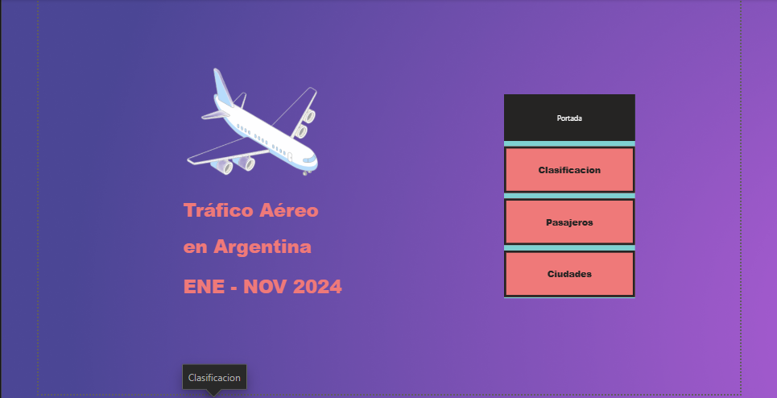

# ✈️ Argentina Air Traffic Analysis

## 📌 Overview

This project analyzes air traffic in Argentina using Power BI, SQL, and a normalized relational data model.

The goal is to transform raw flight data into interactive dashboards that help answer business questions about airport activity, passenger traffic, and flight operations.

